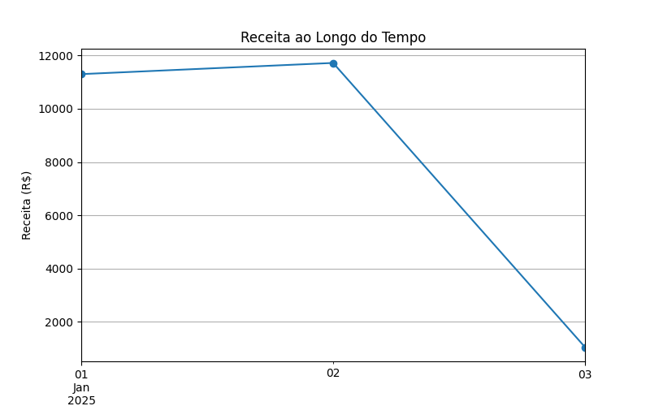
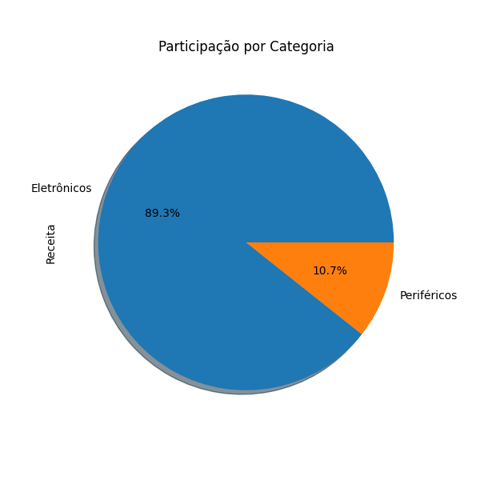

# 📊 Dashboard de Vendas

Projeto de **Dashboard de Dados de Vendas** em Python, com gráficos interativos usando **Streamlit** e análises com **Pandas** e **Matplotlib**.  

---

## 🌟 Funcionalidades

- Receita total ao longo do tempo
- Participação de cada categoria no faturamento
- Filtros por categoria no dashboard interativo
- Visualização gráfica diretamente no GitHub via imagens

---

## 📷 Exemplos de Gráficos 

### Receita ao Longo do Tempo

### Participação por Categoria

---

## 🛠 Como Executar Localmente

1. Clone o repositório:
git clone https://github.com/davila-ravena/DashboardVendas.git
cd DashboardVendas

2. Ative a venv:
.\venv\Scripts\Activate.ps1

3. Instale as dependências:
pip install -r requirements.txt

4. Rode o dashboard interativo:
python -m streamlit run app.py

5. Abra o navegador no link mostrado pelo terminal (ex.: http://localhost:8501).

